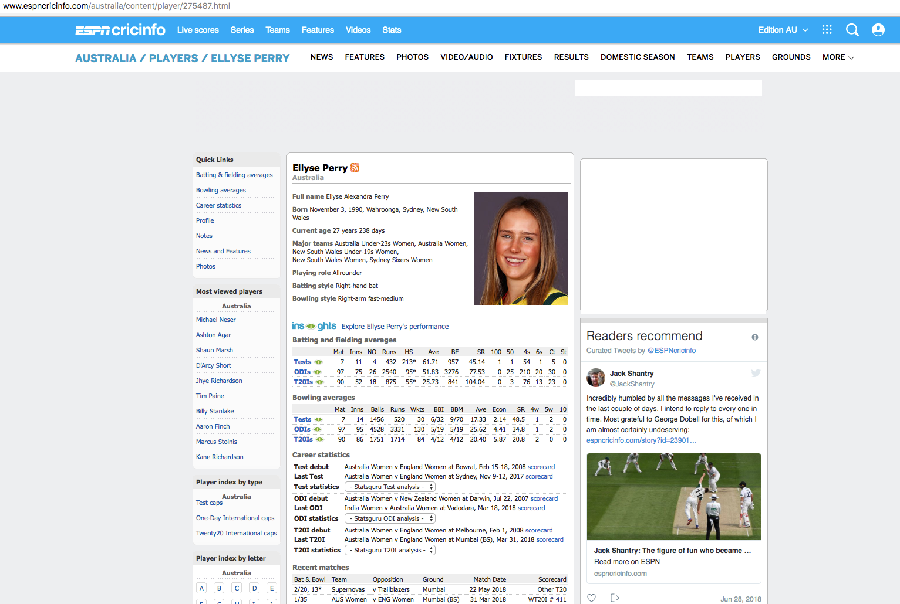

```{r setup, include=FALSE}
knitr::opts_chunk$set(
  message = FALSE,
  warning = FALSE,
  collapse = TRUE,
  echo = TRUE,
  comment = "",
  fig.height = 3,
  fig.width = 7,
  fig.align = "center",
  cache = TRUE
)

library(xaringan)
library(dplyr)
library(ggplot2)
library(plotly)
library(magrittr)
library(cricketdata)
          library(kableExtra)
library(bindrcpp)

theme_set(theme_light(base_size = 23))
```

##Invented in England in the 13th century but gained popularity in 17th century


```{r History-Cricket,echo=FALSE,fig.width = 7,fig.cap="A 1779 cricket match played by the Countess of Derby and other ladies"}
knitr::include_graphics("Figs/Women_Cricket.png")
```


---

# Fun Fact #1

```{r Old_Way,echo=FALSE,fig.width = 4,fig.cap="Underarm Bowling"}
knitr::include_graphics("Figs/oldway.png")
```

---

```{r New_Way,echo=FALSE,fig.width = 4,fig.cap="Roundarm Bowling"}
knitr::include_graphics("Figs/newway.png")
```

### Pioneered by a woman in the early 19th century to avoid entangling the skirt

---

class: left,middle

# Quick Facts


- Involves two teams with 11 players on each side


- The objective is to score the more runs than the opponent


- Key Players are *Batsman*, *Bowler* and *Fielder*

---

#Cricket Field Guide

```{r Cricket_Field, echo=FALSE, out.width = '100%'}
knitr::include_graphics("Figs/Cricket.png")
```
---

class: left,middle


# Quick Facts

###Played in many formats

- *TEST* : played over 5 days 

- *ODI* :  50 overs per side

- *T20* : 20 overs per side

---

#### Top Six Cricket Crazy Nations:
                  
                  
- INDIA, BANGLADESH, PAKISTAN, AUSTRALIA, ENGLAND, SRILANKA, NEW ZEALAND, SOUTH AFRICA


---


---

####Structure of [ESPNcricinfo](http://www.espncricinfo.com/) - One of the few Sophisticated takes on International Cricket Performance

- _**StatsGuru**_ a database of historical matches and players from the 18th century to the present
---

###ESPNcricinfo Tour


```{r Espn_Cricinfo1,echo=FALSE, fig.out="100%"}


                        
```
---
```{r Espn_Cricinfo2,echo=FALSE, fig.out="100%"}


                        
```
---

```{r Espn_Cricinfo3,echo=FALSE, fig.out="100%"}


                        
```
---

```{r Espn_Cricinfo4,echo=FALSE, fig.out="100%"}


                        
```
---

```{r Espn_Cricinfo5,echo=FALSE, fig.out="100%"}


                        
```

---

```{r Structure_ESPN,echo=FALSE}
Batsman=c("Total Runs Scored", "Number of Balls Faced","Number of Fours and Sixes", "Strike Rate, Opposition", "Position", "Dismissal", "Innings", "Ground", "Date of the Match")
Bowler = c("Number of Overs Bowled", "Number of Maiden Overs", "Number of Runs given", "Number of Wickets", "Position", "Innings", "Oppsition", "Ground","Date of the Match")
Fielder = c("Number of Dismissals", "Number of Catches", "Number of Stumped", "Number of Wicket Keeper Catches","Innings", "Oppsition", "Ground", "Date of the Match", "")
knitr::kable(cbind(Batsman,Bowler,Fielder),align = "c")%>%kable_styling(c("striped"), full_width = TRUE,font= 12 )
```

---

class: center,middle

#Challenges??

--

_**Collectively, all this data has the potential to create vast opportunities to analyze and make meaningful insights**_


- User needs to insert a query in the website every time to obtain information about performance of a player

- Limited ways to save those tables efficiently for comprehensive comparison of two or more players and facilitate statistical thinking in cricket

---
class: center,middle

#Package Cricketdata 

##Opening door to more data driven stories for men's and women's cricket

---
# Package - [CricketData](https://github.com/ropenscilabs/cricketdata)

Contains scraper functions for downloading data from ESPNCricinfo into tibbles which can be readily used to analyse the performance of players across different game formats and activities


_**fetch_cricinfo**_ : Innings/Career wise summary of the players for all countries (*Existed Before*)

_**find_player_id**_ : Obtain the player id when the user types the name (may be partial) of the player

_**fetch_player**_ : Obtain the performance of a player in different formats like TESTS, ODI or T20 and different activities like batting, fielding and bowling using the player id obtained from *find_player_id*

---
class: center,middle

## Question : Does batsmen with higher ducks have higher scores on an average?

- Average score will be less if number of ducks are more! But we are talking about high scores

Ducks: Explain


---
```{r Plots,echo=FALSE,,out.width="100%",out.height="100%"}
odibat_M <- fetch_cricinfo("odi", "Men", "Batting")

 par(mfrow=c(2,2))
odibat_M %>%mutate(Ducks_Rate=Ducks/Matches)%>%mutate(Matches=case_when(Matches<=50 ~ "Less than 50",
                                     Matches<=100 ~"Between 50 and 100",
                                     Matches<=150 ~"Between 100 and 150",
                                     Matches >150 ~"More than 150", TRUE ~ as.character(Matches)))->odibat_M_1

odibat_M_1 %>% filter(Matches=="Less than 50") %>% ggplot(aes(y = Average, x = Ducks_Rate,col=HighScore,Player=Player,Country=Country)) +
  geom_point(alpha=0.3,col="blue") + 
  ylab("Average Score") +xlab("Duck Rate")+theme(plot.title = element_text(family = "Trebuchet MS", color="#666666", face="bold", size=22, hjust=0)) +
  theme(axis.title = element_text(family = "Trebuchet MS", color="#666666", face="bold", size=14)) +
  theme(axis.text = element_text(family = "Trebuchet MS", color="#666666", face="bold", size=14))+ theme(legend.position = "bottom") -> p
 


ggplotly(p)
```
---
```{r, Between50and100,echo=FALSE,,out.width="100%",out.height="100%"}  
odibat_M_1 %>% filter(Matches=="Between 50 and 100") %>% ggplot(aes(y = Average, x = Ducks_Rate,col=HighScore,Player=Player,Country=Country)) +
  geom_point()+
  ylab("Average Score") +xlab("Duck Rate")+theme(plot.title = element_text(family = "Trebuchet MS", color="#666666", face="bold", size=22, hjust=0)) +
  theme(axis.title = element_text(family = "Trebuchet MS", color="#666666", face="bold", size=14)) +
  theme(axis.text = element_text(family = "Trebuchet MS", color="#666666", face="bold", size=14))+ theme(legend.position = "bottom") ->p1


ggplotly(p1)
```
---
```{r, Between100and150,echo=FALSE,out.width="100%",out.height="100%"}  

odibat_M_1 %>% filter(Matches=="Between 100 and 150") %>% ggplot(aes(y = Average, x = Ducks_Rate,col=HighScore,Player=Player,Country=Country)) +
  geom_point()+ 
  ylab("Average Score") +xlab("Duck Rate")+theme(plot.title = element_text(family = "Trebuchet MS", color="#666666", face="bold", size=22, hjust=0)) +
  theme(axis.title = element_text(family = "Trebuchet MS", color="#666666", face="bold", size=14)) +
  theme(axis.text = element_text(family = "Trebuchet MS", color="#666666", face="bold", size=14))+ theme(legend.position = "bottom") ->p2


ggplotly(p2)
```
---
  
```{r, Morethan150,echo=FALSE,out.width="100%",out.height="100%",}  
odibat_M_1 %>% filter(Matches=="More than 150")%>%filter(Average>35) %>% ggplot(aes(y = HighScore, x = Ducks_Rate,col=Average,Player=Player,Country=Country)) +
  geom_point()+
  ylab("Average Score") +xlab("Duck Rate")+ theme(plot.title = element_text(family = "Trebuchet MS", color="#666666", face="bold", size=22, hjust=0)) +
  theme(axis.title = element_text(family = "Trebuchet MS", color="#666666", face="bold", size=14)) +
  theme(axis.text = element_text(family = "Trebuchet MS", color="#666666", face="bold", size=14))+ theme(legend.position = "bottom") -> p3


ggplotly(p3)
#htmltools::tagList(list(p, p1,p2,p3))

```
